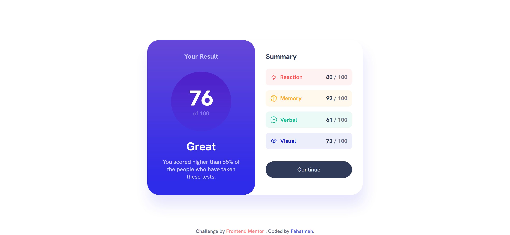
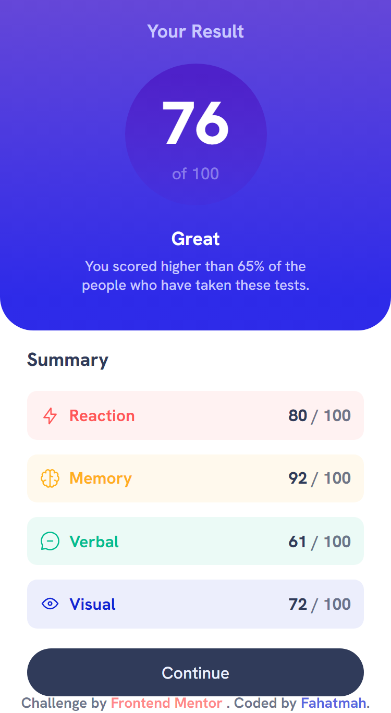

<h1 style="font-size: 3.5rem; font-weight:bold;color:hsl(241, 100%, 89%);">✨Results Summary Component✨</h1>

from <a href="https://www.frontendmentor.io/challenges/results-summary-component-CE_K6s0maV" style="display:flex;gap:0.5rem;align-items:center;justify-content:center;font-weight:bold;color:hsl(0, 100%, 67%);"> Frontend Mentor </a>

<i style="font-size:2rem;">Screenshots</i>

# Links

- Solution URL: [Repository]()
- Live Site URL: [Live Site]()

# Built with

- Semantic HTML5 markup
- CSS custom properties
- Flexbox
- Mobile-first workflow
- Javascript

# Author

- Frontend Mentor - [@Fahatmah 💙](https://www.frontendmentor.io/profile/Fahatmah)
